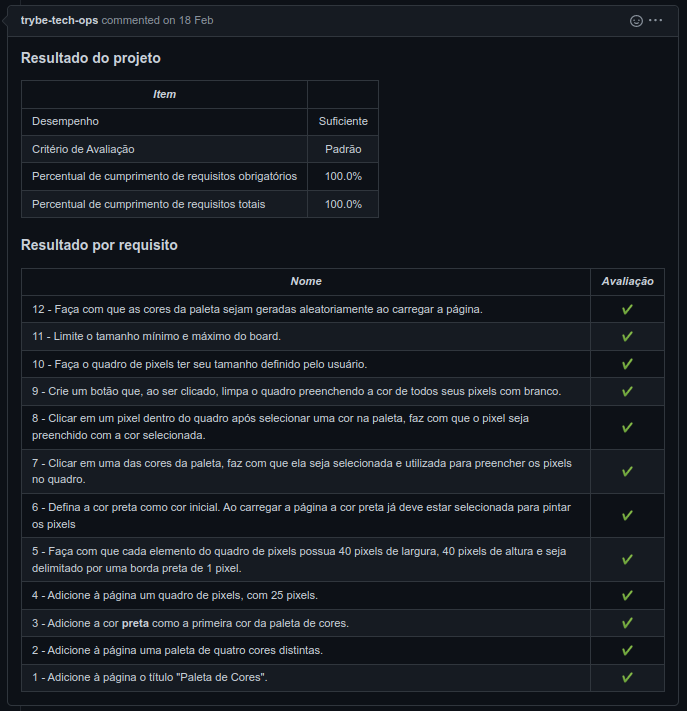
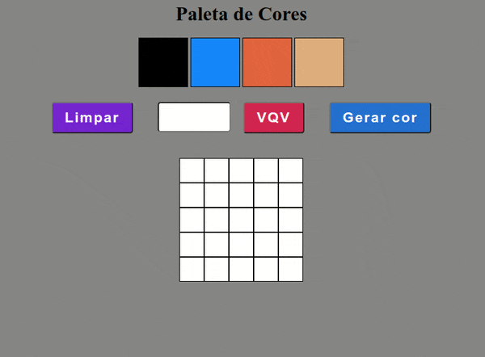

# Português

  

    Sabia mais
  

  
  # Pixels Art
Projeto da [Trybe](https://www.betrybe.com/) - Bloco 5 - Aplicação para construção de imagens com pixels coloridos feita com HTML, CSS e JavaScript.

## 💻 Projeto

  
<strong>🆠Meu desempenho</strong>
 

  

  

  
<strong>🖼️ Gif do projeto</strong>
 

  

## 🚀 Tecnologias
> Este projeto foi desenvolvido com:

- HTML
- CSS
- JavaScript

## 📌 Habilidades
> Habilidades desenvolvidas:

- Manipular o DOM;
- Manipular o JavaScript.
  
## Time de desenvolvimento
> Projeto individual:
  

## 💬 Contatos

   
   
   

# English

  

    More
  

  
  # Pixels Art
Project from [Trybe](https://www.betrybe.com/) - Block 5 - Application to build images with colored pixels done with HTML, CSS and JavaScript.

## 💻 Project

  
<strong>🆠My accomplishment</strong>
 

  

  

  
<strong>🖼️ Project's Gif</strong>
 

  

## 🚀 Technologies
> This project was developed with:

- HTML
- CSS
- JavaScript

## 📌 Skills
> Practiced skills:

- DOM manipulation;
- JavaScript manipulation.
  
## Squad
> Single person project:
  

## 💬 Contact

   
   
   

# Deutsch

  

    Mehr
  

  
  # Pixels Art
Projekt von [Trybe](https://www.betrybe.com/) - Block 5 - Applikation um Bilder mit gefärbten Pixels erzustellen, mit HTML, CSS uns JavaScript hergestellt.
  

## 💻 Projekt

  
<strong>🆠Meine Leistung</strong>
 

  

  

  
<strong>🖼️ Projekts Gif</strong>
 

  

## 🚀 Technologies
> Dieses Projekt wurde mit den entsprechenden Technologies hergestellt:

- HTML
- CSS
- JavaScript

## 📌 Fähigkeiten
> Ausgeübte Fähigkeiten:

- DOM Manipulation;
- JavaScript Manipulation.
  
## Entwickungsteam
> Eine Person Projekt:
  

## 💬 Kontakt

   
   
   

